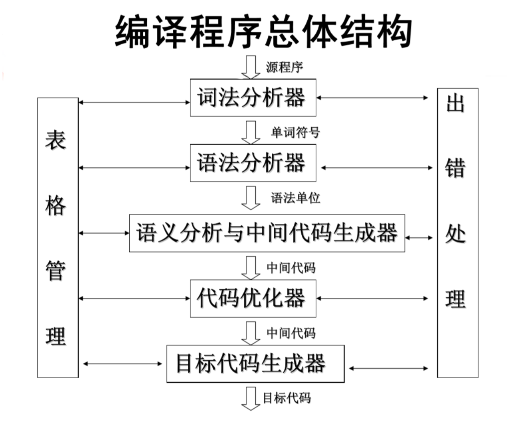
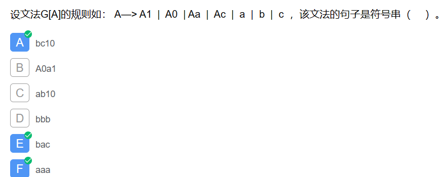
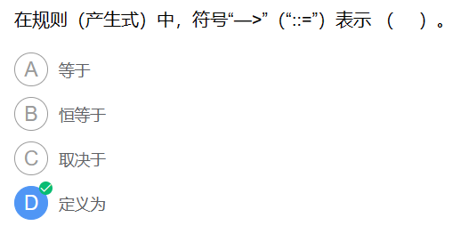

# 提纲

## 引论：

### 编译、翻译、解释的概念（掌握）

翻译包括编译与解释，翻译功能就是把程序转化为同等的更低级语言

**翻译程序**是指把高级语言源程序翻译成机器语言程序（目标代码） 的软件。

编译（Compile）的过程是把整个源程序代码翻译成另外一种代码，翻译后的代码等待被执行或者被优化等等，发生在运行之前，产物是 **另一份代码** 。

解释（Interpret）的过程是把源程序代码一行一行的读懂，然后一行一行的执行，发生在运行时，产物是 **运行结果** 。

### 编译过程（掌握）

* 词法分析，对构成源程序的字符串进行扫描和分解，识别出一个个的单词符号；
* 语法分析，根据语言的语法规则，把单词符号串组合成各类语法单位；
* 语义分析与中间代码产生，对各类语法单位，分析其含义并进行初步翻译；
* 代码优化，对代码进行等价变换，以期产生更高效的代码；
* 目标代码生成，把中间代码变换成特定机器上的低级语言指令形式。

### 编译程序的结构（掌握）

~~编译程序的生成技术（了解）~~

## 高级语言形式化：

### 上下文无关文法（掌握）

一个四元组 $(V,\Sigma, R, S)$

$V$ 是所有非终结符的集合
$\Sigma$ 是所有终结符的集合
$R $ 是所有语法规则的集合；其中语法规则的组成是 “任意终结符和非终结符的组合”，符号表示为  $(V\cup \Sigma)$

$S$  表示开始状态
用  $\Rightarrow^*$ 来表示 $\Rightarrow$ 的自反闭包

#### 终结符号、非终结符号、产生式

### 最左推导、最右推导(规范推导)、归约(规范归约)、语法树（掌握）

句子的推导是我们从开始符号，推出我们想要的句子的过程。与之相反，拿到一个句子，我们反推回开始符号，这个过程是句子的规约。

最右推导（规范推导）： 对于直接推导 $xUy⇒ xuy$，如果y只包含终结符号或者为空符号串（相当于右边已经没有可以被拆分的非终结符了），那么，就把这种直接推导称为规范推导。
最左推导： 与最右推导相反。
最左规约： 为最右推导的逆过程，对于一个句子，每次都从最左端，可规约的符号或符号串（句柄）来规约。

### 句子、句型（规范句型）、短语、直接短语、句柄（掌握）

### 文法定义的语言(理解)

### 文法的二义性(理解)

二义性文法——不可判定的

* 文法所定义的某个句子存在两棵不同的语法树。
* 文法中存在某个句子，它有两个不同的规范（最右）推导。
* 文法中存在某个句子，它有两个不同的规范（最左）规约，即在规约中某些规范句型的句柄不唯一。

注意：

1. 如果存在两种推导，那么不能说明一定是二义性文法，因为两种推导可能对应同一个语法树

~~0型、1型 （了解）~~

### 2型、3型文法（掌握）

2型文法：又称为上下文无关文法：

产生式形如：  $ A ->β$
解释：式子左边必须是非终结符，然而一个终结符一个非终结符的组合不是一个非终结符，如Ab不是一个非终结符，但是两个非终结符的组合就是一个非终结符了，如AB就是行了；式子右边可以有多个字符，可以是终结符，也可以是非终结符，但必须是有限个字符
举例：$AB->abc$，$B->ab$

3型文法：又称为正规文法（正规文法又包括左线性文法和右线性文法）：

左线性文法：

产生式形如： $A  ->Bα$ 或 $A  ->α$
解释：式子左边只能有一个字符，而且必须是非终结符；式子右边最多有二个字符。如果有二个字符必须是（非终结符+终结符）的格式，如果是一个字符，那么必须是终结符。
举例：$B->Ba$

右线性文法：

产生式形如： $A  ->αB$ 或 $A  ->α$
解释：式子左边只能有一个字符，而且必须是非终结符；式子右边最多有二个字符。如果有二个字符必须是（终结符+非终结符）的格式，如果是一个字符，那么必须是终结符。
举例：$B->aB$

## 词法分析：

词法分析器的功能、单词的表示（掌握）

状态转换图表示FA（掌握）

正规式与正规集（掌握）

DFA、NFA

与正规式等价的FA、NFA的确定化、DFA的化简 （掌握）

正规文法（左/右线性文法）(理解)

正规式与正规文法的等价性 (理解)

正规文法与FA的等价性 (理解)

## 语法分析：

自上而下分析：LL(1)分析

文法的左递归、回溯

LL(1)文法条件（掌握）

FIRST集合、FOLLOW集合、SELECT集合

递归下降分析法（掌握）

预测分析法（掌握）

自下而上分析：移进-归约分析

~~算符优先分析法 （了解）~~

LR分析法
LR分析算法

前缀、活前缀、LR(0)项目集规范族（掌）

识别规范句型活前缀的DFA（掌握）

LR(0)分析表、SLR(1)分析表（掌握）

~~LR(1)项目集规范族（了解）
LR(1)分析表、LALR(1)分析表（了解）
出错处理（了解）
语法分析器自动构造工具YACC（了解）~~

## 语义分析和中间代码生成：

属性文法 （理解）

中间语言（理解）三地址代码及其四元式存储表示

一遍扫描的语法制导翻译（理解）

递归下降语法制导翻译技术（理解）

~~LR语法制导翻译技术（了解）~~

> 期末考试题型：选择题 判断题 简答题 应用题
> 复习方向：本章小结、书本例题、课后习题、作业

# 课堂习题

## 第1章

在形式语言中，最右推导的逆过程也称为规范归约。

一个句型最左边的（  **直接短语** ）称为该句型的句柄。

一个语言的文法是唯一的。（X）

一个句型中出现某一个产生式的右部，则此右部一定是此句型的直接短语。（X）

## 第2章

编译程序中的词法分析器的输出是二元组表示的单词符号，其二元组的两个元素是 **单词种别、单词自身的值**

通常程序设计语言中的单词符号都能用（ **正规式、正规文法** ）描述。

一张状态转换图只包含有限个状态，其中有一个被认为是初态，最多只有一个终态。 (X)

DFA的终态与非终态是可区别的。

文法符号集合不是NFA的成分

NFA的正式定义，由以下几个部分组成：

1. 有穷的状态集合 $S$ 。
2. 输入集合符号 $Σ$ ，也即输入字母表，假设代表空串的 $ε$ 不是 $Σ$ 中的元素。
3. 转换函数（transition function），为每个状态和 $Σ∪ε$ 中的每个符号都给出了相应的后继状态（next state）的集合。
4. $S$ 中的一个状态 $S_0$ 被指定为开始状态，或者是初始状态。
5. $S$ 中的一个子集 $F$ 被指定为接受状态（或者说终止状态）的集合。

一个确定的有穷自动机DFA $M$ 的转换函数 $f$ 是一个从$Q × ∑$ 到 Q 的子集的映射。(X)

是一个从$Q  ×  ∑$ 到 $Q$ 的映射

## 第3章

LL(1)文法是无左递归、无二义性文法。

递归下降分析法和预测分析法要求描述语言的文法是 **LL(1)文法**

在高级语言编译程序常用的语法分析方法中，递归下降分析法属于**自上而下**分析方法。

自下而上语法分析法的原理是 “移进-归约”法

LR分析法是一种规范归约分析法。

LR(0)项目集规范族的项目的类型可分为:

1. 移进项目
2. 待约项目
3. 接受项目
4. 归约项目

LR语法分析栈中存放的状态是识别文法规范句型 **活前缀** 的DFA状态。

设有-个LR(0) 项目集 $I = \{ X→ a.bB,A→α.,B→α. \}$,该项目集含有冲突项目，它们是

移进-归约 冲突
归约-归约 冲突
